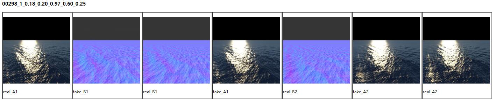
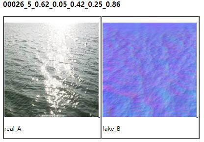

The dataset consists of a series of images like the one shown above. Some examples are provided in the dataset folder. For more data, please contact the author.

Train a model by running train.py 
To view training results and loss plots, run `python -m visdom.server` and click the URL http://localhost:8097. To see more intermediate results, check out `./checkpoints/result/web/index.html`.
A trained model is provided in ./checkpoints/result,named latest_net_G_A.pth and latest_net_G_B.pth.

Test the model:
Test the full net by running test_full_net.py on the data from ./dataset/test
Test the normal reconstruction net by running test_G_A.py on the real water images from ./dataset/test_real

   

